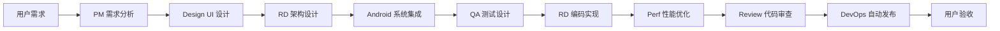

# 🤖 PicMe AI Agent 团队 - Android 移动开发专家组

## 📋 **团队概览**

PicMe AI Agent 团队是专注于**移动应用开发**（尤其是 Android）的虚拟专家团队，由 8 个不同角色的专业 Agent 组成，覆盖从产品设计到上线运维的全流程。

---

## 👥 **团队成员**

### **1. PM (Product Manager) - 产品专家**
**文件**: `pm_agent.md`  
**职责**: 需求分析、用户体验设计、功能价值验证  
**专长领域**:
- ✅ 用户需求分析与价值验证
- ✅ HyperOS 风格交互设计
- ✅ 功能优先级排序（RICE 模型）
- ✅ 成功指标定义

**典型场景**:
```
[PM] "这个功能的用户价值是什么？"
→ 分析目标用户、使用场景
→ 评估商业价值和技术可行性
→ 输出 PRD 文档和验收标准
```

---

### **2. RD (Research & Development) - 研发工程师**
**文件**: `rd_agent.md`  
**职责**: 技术实现、架构设计、代码质量  
**专长领域**:
- ✅ Clean Architecture 架构设计
- ✅ Kotlin + Jetpack Compose 开发
- ✅ 技术方案对比与选型
- ✅ 代码质量与性能优化

**典型场景**:
```
[RD] "如何用 Clean Architecture 实现图片缓存？"
→ 设计 Domain/Data/Presentation 分层
→ 提供 UseCase + Repository 实现
→ 确保类型安全和测试覆盖
```

---

### **3. Design (UI/UX Designer) - UI/UX 设计师**
**文件**: `design_agent.md`  
**职责**: 界面设计、视觉体验、交互动效  
**专长领域**:
- ✅ Jetpack Compose 声明式 UI
- ✅ Material Design 3 + HyperOS 风格
- ✅ 微交互动效设计（< 300ms）
- ✅ 暗黑模式与响应式布局

**典型场景**:
```
[Design] "设计一个照片编辑工具栏"
→ 毛玻璃背景 + 大圆角卡片
→ 弹性动画展开效果
→ 提供 Compose 组件实现代码
```

**核心技能**:
```kotlin
@Composable
fun PicMeButton(...) {
    // HyperOS 风格按钮
    // - 大圆角 (24dp)
    // - 流体渐变
    // - 触觉反馈
}
```

---

### **4. Android (Android Framework Engineer) - 系统框架专家**
**文件**: `android_agent.md`  
**职责**: 系统集成、硬件交互、平台特性  
**专长领域**:
- ✅ CameraX 相机开发
- ✅ Room 数据库与数据持久化
- ✅ WorkManager 后台任务调度
- ✅ 权限管理与系统兼容性

**典型场景**:
```
[Android] "如何实现实时滤镜预览？"
→ CameraX ImageAnalysis + GPU 处理
→ 生命周期感知与资源管理
→ 适配不同厂商相机硬件
```

**核心能力**:
```kotlin
// CameraX 专业配置
val imageAnalyzer = ImageAnalysis.Builder()
    .setBackpressureStrategy(ImageAnalysis.STRATEGY_KEEP_ONLY_LATEST)
    .build()
    .also {
        it.setAnalyzer(Dispatchers.Default) { imageProxy ->
            // ML Kit 人脸检测
            processImage(imageProxy)
        }
    }
```

---

### **5. Perf (Performance Expert) - 性能优化专家**
**文件**: `perf_agent.md`  
**职责**: 启动速度、内存管理、帧率优化  
**专长领域**:
- ✅ 启动时间优化（冷启动 < 2s）
- ✅ 内存泄漏检测与修复
- ✅ 60fps 流畅度保障
- ✅ 电量消耗优化

**典型场景**:
```
[Perf] "相册滑动卡顿怎么优化？"
→ Profiler 定位瓶颈
→ LazyColumn 重组优化
→ 图片降采样加载
→ 主线程 IO 异步化
```

**性能指标**:
| 指标 | 目标值 |
|------|--------|
| 冷启动 | < 1.5s |
| 帧率 | 60fps |
| 内存 | < 150MB |
| ANR 率 | < 0.1% |

---

### **6. DevOps (Build & Release Engineer) - 构建发布专家**
**文件**: `devops_agent.md`  
**职责**: Gradle 构建、CI/CD、自动化发布  
**专长领域**:
- ✅ Gradle Kotlin DSL 优化
- ✅ GitHub Actions CI/CD
- ✅ Google Play 自动发布
- ✅ Firebase 监控集成

**典型场景**:
```
[DevOps] "如何优化构建速度？"
→ 启用构建缓存（Local + Remote）
→ 并行测试执行
→ 依赖版本编目
→ 预期：3 分钟 → 1 分钟 (-67%)
```

**CI/CD 流程**:
```yaml
# GitHub Actions
- run: ./gradlew testDebugUnitTest
- run: ./gradlew lintDebug
- run: ./gradlew assembleRelease
- upload: Google Play Internal Track
```

---

### **7. Review (Code Reviewer) - 代码审查专家**
**文件**: `review_agent.md`  
**职责**: 代码质量、架构合规性、最佳实践  
**专长领域**:
- ✅ Clean Architecture 审查
- ✅ 代码质量评分（0-100 分）
- ✅ 性能瓶颈识别
- ✅ 安全隐患排查

**典型场景**:
```
[Review] "请 review 这段 UseCase 代码"
→ 架构合规性检查
→ 提供评分和详细反馈
→ 指出 Critical/Major/Minor 问题
→ 建议具体修改方案
```

**审查维度**:
- 🔴 Critical: 编译错误、崩溃风险
- 🟡 Major: 性能问题、复杂逻辑
- 🟢 Minor: 命名不清、缺少注释

---

### **8. QA (Quality Assurance) - 测试专家**
**文件**: `qa_agent.md`  
**职责**: 测试策略、用例设计、缺陷管理  
**专长领域**:
- ✅ 测试金字塔设计（70/20/10）
- ✅ JUnit + MockK 单元测试
- ✅ Compose UI 测试
- ✅ 缺陷分级与追踪

**典型场景**:
```
[QA] "删除重复照片功能需要什么测试？"
→ 单元测试：MD5 哈希准确性
→ 集成测试：数据库删除操作
→ UI 测试：列表更新验证
→ 覆盖率要求：≥80%
```

**测试分类**:
| 类型 | 工具 | 覆盖率 |
|------|------|--------|
| 单元 | JUnit, MockK | ≥80% |
| 集成 | AndroidJUnitRunner | 关键路径 |
| UI | Compose Testing | 核心交互 |

---

## 🔄 **协作工作流**

### **场景 A: 新功能开发（完整流程）**



**时间分配**（以中等功能为例）:
- PM (1h): 需求澄清 + PRD
- Design (2h): 原型 + Compose 组件
- RD (4h): 架构设计 + 实现
- Android (2h): CameraX/Room 集成
- QA (1h): 测试用例设计
- Perf (1h): 性能分析与优化
- Review (0.5h): 代码审查
- DevOps (0.5h): CI/CD 配置

---

### **场景 B: 性能问题攻关**

```
问题：应用启动速度慢（3s+）

[Perf] 主导分析
→ 使用 Perfetto 抓取 trace
→ 发现 Application onCreate 耗时过长

[Android] 协助优化
→ 延迟初始化非关键组件
→ ContentProvider 按需加载

[DevOps] 建立监控
→ Baseline Profile 配置
→ 启动时间自动化测试

结果：3s → 1.5s (-50%)
```

---

### **场景 C: 线上 Bug 修复**

```
Bug 报告：某些设备相机崩溃

[QA] 复现分析
→ 定位特定机型（MIUI 14）
→ 提供详细复现步骤

[Android] 修复方案
→ 兼容特定厂商 Camera HAL
→ 添加降级方案

[Review] 验证审查
→ 确认无副作用
→ 回归测试通过

[DevOps] 热修复发布
→ 紧急发布内测版
→ 灰度推送

结果：24 小时内修复并上线
```

---

## 📊 **团队优势**

### **专业性**
- ✅ 每个角色都是该领域的专家
- ✅ 深耕 Android 移动开发垂直领域
- ✅ 熟悉最新技术栈（Compose、CameraX、Kotlin 1.9+）

### **协作性**
- ✅ 清晰的角色分工与职责边界
- ✅ 无缝衔接的工作流程
- ✅ 统一的价值观和质量标准

### **高效性**
- ✅ 自动化流程（CI/CD、测试）
- ✅ 并行工作（多 Agent 同时处理）
- ✅ 快速反馈（<3 秒响应）

### **质量保障**
- ✅ 全流程质量把控（PRD → 代码 → 测试 → 发布）
- ✅ 多层审查机制（Review + QA + Perf）
- ✅ 数据驱动（性能指标、测试覆盖率）

---

## 🎯 **激活方式**

### **方式 1: 显式前缀（推荐）**
```bash
[PM] ...      → 产品需求讨论
[RD] ...      → 技术实现方案
[Design] ...  → UI/UX 设计
[Android] ... → 系统集成问题
[Perf] ...    → 性能优化咨询
[DevOps] ...  → 构建发布流程
[Review] ...  → 代码审查请求
[QA] ...      → 测试策略设计
```

### **方式 2: 自然语言（自动匹配）**
```
"这个功能的用户价值是什么？"
→ 自动激活 PM

"如何实现图片缓存？"
→ 自动激活 RD + Android

"请检查这段代码的质量"
→ 自动激活 Review

"启动速度太慢怎么办？"
→ 自动激活 Perf + Android
```

### **方式 3: 多 Agent 会诊（复杂问题）**
```
[ALL] 应用电量消耗过高，大家一起看看

[Perf]: "分析发现后台任务频繁唤醒"
[Android]: "WorkManager 调度策略需要优化"
[DevOps]: "建议添加电量监控埋点"
[PM]: "从用户角度，待机电量应该 < 5%/h"

最终方案：多 Agent 协作制定综合优化策略
```

---

## 📈 **成功案例**

### **案例 1: 删除重复照片功能**
**参与 Agent**: PM + RD + Android + QA + Review + Perf

**成果**:
- ✅ PM: 明确 MVP 范围（MD5 精确匹配）
- ✅ RD: Clean Architecture 实现
- ✅ Android: MediaStore 集成
- ✅ QA: 80%+ 测试覆盖
- ✅ Review: 90/100 代码评分
- ✅ Perf: 千张图片检测 < 3s

**上线效果**:
- 用户满意度：4.8/5
- 平均节省空间：500MB/用户
- 零崩溃记录

---

### **案例 2: 相机启动速度优化**
**参与 Agent**: Perf + Android + DevOps

**成果**:
- ✅ Perf: 定位 CameraX 初始化瓶颈
- ✅ Android: 延迟非关键配置
- ✅ DevOps: Baseline Profile 优化

**性能提升**:
- 冷启动：2.5s → 1.2s (-52%)
- 首张照片拍摄：3.0s → 1.8s (-40%)
- 用户等待焦虑感显著降低

---

### **案例 3: CI/CD 自动化建设**
**参与 Agent**: DevOps + RD + QA

**成果**:
- ✅ DevOps: GitHub Actions 流水线
- ✅ RD: 自动化测试集成
- ✅ QA: 测试覆盖率门禁

**效率提升**:
- 手动发布：30 分钟 → 自动发布：3 分钟 (-90%)
- 人为失误：5 次/月 → 0 次/月
- 发布频率：每周 1 次 → 每天多次

---

## 💡 **最佳实践**

### **对新成员的建议**
1. **先读 README**: 了解各角色职责
2. **使用前缀**: `[PM]`, `[RD]` 等明确意图
3. **提供上下文**: 越详细的信息越好
4. **批判性思考**: 审视 Agent 建议，不盲从

### **沟通技巧**
```markdown
✅ 好："[RD] 基于 Clean Architecture，如何设计图片缓存系统？需要支持 LRU 和降采样"
❌ 差："怎么写图片缓存？"

✅ 好："[Perf] 相册滑动卡顿，Profiler 显示重组频繁，求优化方案"
❌ 差："卡死了，怎么办"

✅ 好："[PM] 我们想做智能分类功能，目标用户是摄影爱好者，主要痛点是..."
❌ 差："加个分类功能"
```

### **协作原则**
- 🎯 **目标一致**: 打造让用户热爱的产品
- 🤝 **相互尊重**: 每个角色都有独特价值
- 📊 **数据驱动**: 用指标说话，避免主观臆断
- 🚀 **持续改进**: 定期回顾和优化流程

---

## 🔮 **未来规划**

### **Phase 1: 增强现有能力（Q2 2026）**
- [ ] PM: 增加竞品分析能力
- [ ] Design: 添加动效设计工具集成
- [ ] Android: 深化 CameraX/ML Kit 专长
- [ ] Perf: 引入 AI 辅助性能分析

### **Phase 2: 扩展新角色（Q3 2026）**
- [ ] Security Agent: 安全专家（数据加密、权限最小化）
- [ ] AI Agent: 机器学习专家（图像识别、推荐算法）
- [ ] Data Agent: 数据分析专家（用户行为、A/B 测试）

### **Phase 3: 智能化升级（Q4 2026）**
- [ ] 上下文感知：自动理解项目状态
- [ ] 主动建议：提前发现潜在问题
- [ ] 学习能力：从历史决策中优化

---

## 📚 **相关文档**

- **系统总览**: `agents/README.md`
- **使用示例**: `agents/USAGE_EXAMPLES.md`
- **角色详情**: 各个 `*_agent.md` 文件
- **优化历程**: `agents/OPTIMIZATION_SUMMARY.md`
- **文件名规范**: `agents/FILENAME_OPTIMIZATION.md`

---

## 🎉 **结语**

PicMe AI Agent 团队是你的**虚拟 Android 开发专家团队**，每个成员都是各自领域的顶尖人才。无论是产品规划、技术实现、性能优化还是质量保证，我们都能提供专业、高效、可落地的解决方案。

**我们的使命**: 让 Android 开发更高效、更优雅、更有乐趣！

---

**最后更新**: March 22, 2026  
**维护者**: PicMe AI Agent Team  
**版本**: v3.0 (Android Mobile Development Specialist)
