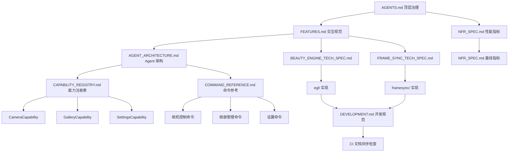

# PicMe 文档导航索引

> **维护者**: CO Agent  
> **最后更新**: 2026-06-21
> **版本**: 1.2

---

## 📚 文档体系总览

PicMe 采用**四层文档架构**，遵循 AGENTS.md 顶层治理规则：

```
┌─────────────────────────────────────────────────────────────────┐
│  LAYER 1: PRODUCT (产品层) - What & Why                         │
│  ─────────────────────────────────────────────────────────────  │
│  • FEATURES.md        - 功能交互规范                            │
│  • NFR_SPEC.md        - 非功能性需求（性能/稳定性指标）          │
└─────────────────────────────────────────────────────────────────┘
                           ↓ 引用
┌─────────────────────────────────────────────────────────────────┐
│  LAYER 2: ARCHITECTURE (架构层) - How (High-Level)             │
│  ─────────────────────────────────────────────────────────────  │
│  • AGENT_ARCHITECTURE.md   - Agent 运行时架构                   │
│  • ADR/                    - 架构决策记录                       │
└─────────────────────────────────────────────────────────────────┘
                           ↓ 指导
┌─────────────────────────────────────────────────────────────────┐
│  LAYER 3: TECHNICAL SPECS (技术规范层) - Implementation         │
│  ─────────────────────────────────────────────────────────────  │
│  • BEAUTY_ENGINE_TECH_SPEC.md - 大美丽引擎技术规格              │
│  • FRAME_SYNC_TECH_SPEC.md    - 帧同步美妆技术规格              │
│  • CAMERA_PREVIEW_TECH_SPEC.md - 相机预览技术规格               │
│  • CHAT_UI_UNIFICATION.md     - Chat UI 统一化改造              │
│  • MNN_LANDMARK_DIAGNOSIS.md  - MNN 人脸关键点诊断               │
│  • FACE_DETECTION_ENGINE_ARCHITECTURE.md - 人脸检测引擎架构      │
└─────────────────────────────────────────────────────────────────┘
                           ↓ 实现
┌─────────────────────────────────────────────────────────────────┐
│  LAYER 4: CAPABILITIES (Agent 能力层) - Commands & Tools         │
│  ─────────────────────────────────────────────────────────────  │
│  • CAPABILITY_REGISTRY.md     - Capability 注册表               │
│  • COMMAND_REFERENCE.md       - 命令参考手册                    │
│  • CAPABILITY_IMPLEMENTATION_GUIDE.md - 能力实现指南            │
└─────────────────────────────────────────────────────────────────┘
```

---

## 📖 文档分类详解

### 1️⃣ 产品层 (PRODUCT)

| 文档 | 用途 | 读者 |
|------|------|------|
| [`FEATURES.md`](./01-PRODUCT/FEATURES.md) | 用户交互流程、体验规则、参数范围 | PM/RD/QA |
| [`NFR_SPEC.md`](./01-PRODUCT/NFR_SPEC.md) | 性能/稳定性/隐私量化指标 | QA/RD |

**核心内容**：
- Agent 交互模式（对话/快捷）
- 美颜系统参数与交互
- 滤镜/风格特效规范
- 拍摄交互（快门反馈/人脸十字星）
- 动态相册查看器
- 性能红线（启动<500ms、快门<50ms、跟手<100ms）

---

### 2️⃣ 架构层 (ARCHITECTURE)

| 文档 | 用途 | 读者 |
|------|------|------|
| [`AGENT_ARCHITECTURE.md`](./02-ARCHITECTURE/AGENT_ARCHITECTURE.md) | Agent 运行时架构、Capability 模型 | RD/CO |
| [`ADR/`](./02-ARCHITECTURE/ADR/) | 架构决策记录（历史决策背景与权衡） | RD/CR |

> 注：原 `02-TECH/` 目录已合并至 `03-TECHNICAL-SPECS/`，技术规范统一收口。 |

**核心内容**：
- AgentOrchestrator 编排器设计
- SceneManager 场景管理
- Capability 接口与扩展机制
- PromptBuilder 分层构建策略
- LocalLlmEngine 推理引擎封装

**ADR 清单**：
- `ADR-001-beauty-engine-architecture.md` - 美颜引擎架构演进
- `ADR-002-opengl-offscreen-unified-pipeline.md` - 离屏渲染统一管线
- `ADR-003-coordinate-system-management.md` - 坐标系管理规范
- `ADR-004-gpu-contention-resolution.md` - GPU 争用解决方案
- `ADR-005-local-remote-inference-split.md` - 本地/远程推理协议分离
- `ADR-006-command-system-separation.md` - 命令系统包隔离
- `ADR-007-natural-language-photo-search.md` - 端侧自然语言相册搜索

---

### 3️⃣ 技术规范层 (TECHNICAL SPECS)

| 文档 | 用途 | 读者 |
|------|------|------|
| [`BEAUTY_ENGINE_TECH_SPEC.md`](./03-TECHNICAL-SPECS/BEAUTY_ENGINE_TECH_SPEC.md) | 大美丽引擎完整技术规格 | RD |
| [`FRAME_SYNC_TECH_SPEC.md`](./03-TECHNICAL-SPECS/FRAME_SYNC_TECH_SPEC.md) | 帧同步美妆系统详细设计 | RD |
| [`CAMERA_PREVIEW_TECH_SPEC.md`](./03-TECHNICAL-SPECS/CAMERA_PREVIEW_TECH_SPEC.md) | 相机预览管线技术约束 | RD |
| [`CHAT_UI_UNIFICATION.md`](./03-TECHNICAL-SPECS/CHAT_UI_UNIFICATION.md) | Chat UI 统一化改造 | RD |
| [`AGENT_UI_DESIGN.md`](./03-TECHNICAL-SPECS/AGENT_UI_DESIGN.md) | Agent UI 层设计（Plan 消息气泡） | RD |
| [`REMOTE_INFERENCE_ARCHITECTURE.md`](./03-TECHNICAL-SPECS/REMOTE_INFERENCE_ARCHITECTURE.md) | 远程推理架构（含 IntentCache L1 缓存） | RD |
| [`REMOTE_REACT_ARCHITECTURE_REVIEW.md`](./03-TECHNICAL-SPECS/REMOTE_REACT_ARCHITECTURE_REVIEW.md) | 远程推理 ReAct 模式架构审查 | RD |
| [`KWS_MIGRATION_TECH_SPEC.md`](./03-TECHNICAL-SPECS/KWS_MIGRATION_TECH_SPEC.md) | KWS 唤醒词 + 语音栈迁移技术方案 | RD |
| [`WAKE_WORD_OPTIMIZATION.md`](./03-TECHNICAL-SPECS/WAKE_WORD_OPTIMIZATION.md) | 语音唤醒词引擎优化方案 | RD |
| [`IM_REMOTE_CONTROL_TECH_SPEC.md`](./03-TECHNICAL-SPECS/IM_REMOTE_CONTROL_TECH_SPEC.md) | IM（飞书）远程控制技术规范 | RD |
| [`AGENT_BASED_AUTOMATION_TEST.md`](./03-TECHNICAL-SPECS/AGENT_BASED_AUTOMATION_TEST.md) | Agent 驱动的自动化测试架构 | QA/RD |
| [`MNN_LANDMARK_DIAGNOSIS.md`](./03-TECHNICAL-SPECS/MNN_LANDMARK_DIAGNOSIS.md) | MNN 人脸关键点对齐问题诊断 | RD |

**核心内容**：
- Agent 运行时核心组件已迁移至 `:agent-core` 模块
- EGL 上下文管理、Shader 编译、资源释放
- FrameId 体系、FrameSyncManager、预测补偿算法
- MNN/NCNN 双引擎人脸检测（InsightFace ONNX 路径已移除）
- ROC 关键点映射、MNN 维度类型修复
- 远程推理架构：IntentCache（L1 缓存）、本地/远程协议分离（ADR-005）、命令系统包隔离（ADR-006）

---

### 4️⃣ Agent 能力层 (CAPABILITIES)

| 文档 | 用途 | 读者 |
|------|------|------|
| [`CAPABILITY_REGISTRY.md`](./04-AGENT-CAPABILITIES/CAPABILITY_REGISTRY.md) | 所有 Capability 列表与命令映射 | RD/CO |
| [`COMMAND_REFERENCE.md`](./04-AGENT-CAPABILITIES/COMMAND_REFERENCE.md) | 命令语法、参数、示例 | RD/PM |
| [`CAPABILITY_IMPLEMENTATION_GUIDE.md`](./04-AGENT-CAPABILITIES/CAPABILITY_IMPLEMENTATION_GUIDE.md) | 新增 Capability 的实现步骤 | RD |

**核心内容**：
- CameraCapability（拍照/录像/美颜/滤镜）
- GalleryCapability（查看/删除/分享/搜索）
- SettingsCapability（主题/语言/模型管理）
- NavigationCapability（页面切换/返回）
- 编辑能力预留（待独立 Capability 落地）

---

### 5️⃣ 开发层 (DEVELOPMENT)

| 文档 | 用途 | 读者 |
|------|------|------|
| [`DEVELOPMENT.md`](./05-DEVELOPMENT/DEVELOPMENT.md) | 双螺旋工作流、反向链接规范、CI 规则 | RD/CO |
| [`TASK_MARKUP_SPEC.md`](./05-DEVELOPMENT/TASK_MARKUP_SPEC.md) | `[kimi-task]` 标记语法与解析规则 | PM/CO |
| [`CODE_REVIEW_CHECKLIST.md`](./05-DEVELOPMENT/CODE_REVIEW_CHECKLIST.md) | CR 检查项与一票否决项 | CR/RD |
| [`PLAN-AGENT-UI.md`](./05-DEVELOPMENT/PLAN-AGENT-UI.md) | Agent UI 层实现计划（含 Plan 消息气泡） | RD |
| [`REMOTE_INFERENCE_ARCHITECTURE.md`](../03-TECHNICAL-SPECS/REMOTE_INFERENCE_ARCHITECTURE.md) | 远程推理架构详细设计 | RD |

**核心内容**：
- Spec ↔ Code 双向演进规则
- 反向链接注释格式（`// Spec: ...`）
- CI 文档同步检查脚本
- `[kimi-task]` 解析为 Task JSON

---

### 6️⃣ 质量层 (QA)

| 文档 | 用途 | 读者 |
|------|------|------|
| [`QA_EXECUTION_CHECKLIST.md`](./06-QA/QA_EXECUTION_CHECKLIST.md) | 端到端验收测试清单 | QA |
| [`NFR_SPEC.md`](./01-PRODUCT/NFR_SPEC.md) | 性能基线数据与量化指标 | QA/RD |

**核心内容**：
- 帧同步专项验收（快转头/人脸出画/录制）
- 性能基线对比（启动时间/帧率/内存）
- 崩溃率/ANR 率监控阈值

---

### 7️⃣ 标准层 (STANDARDS)

| 文档 | 用途 | 读者 |
|------|------|------|
| [`COORDINATE_SYSTEM.md`](./07-STANDARDS/COORDINATE_SYSTEM.md) | 人脸关键点坐标、渲染管线坐标系 | RD |
| [`GLOSSARY.md`](./07-STANDARDS/GLOSSARY.md) | 统一术语定义与禁用别名 | RD/PM |

**核心内容**：
- MediaPipe 468 点 → 106 点映射表
- OpenGL 归一化坐标系 vs UI 像素坐标系
- 帧同步术语（Strict Missing/Prediction Compensation）

---

### 8️⃣ 容灾层 (FALLBACK)

| 文档 | 用途 | 读者 |
|------|------|------|
| [`BEAUTY_ENGINE_FALLBACK.md`](./08-FALLBACK/BEAUTY_ENGINE_FALLBACK.md) | 美颜引擎降级策略与恢复机制 | RD/QA |

**核心内容**：
- EGL 初始化失败降级到基础预览
- 冷却恢复逻辑（30s 内不重复降级）
- 拍照路径 CPU fallback 保障

---

## 🔗 文档引用关系



---

## 🧭 快速导航

### 我是 PM，我想...

- **定义新功能需求** → `FEATURES.md` + `[kimi-task]` 标记
- **梳理交互流程** → `FEATURES.md` 对应章节
- **制定验收标准** → `NFR_SPEC.md` + `QA_EXECUTION_CHECKLIST.md`

### 我是 RD，我想...

- **理解 Agent 架构** → `AGENT_ARCHITECTURE.md`
- **实现新 Capability** → `CAPABILITY_IMPLEMENTATION_GUIDE.md`
- **查阅命令语法** → `COMMAND_REFERENCE.md`
- **了解美颜引擎细节** → `BEAUTY_ENGINE_TECH_SPEC.md`
- **调试帧同步问题** → `FRAME_SYNC_TECH_SPEC.md`
- **编写代码注释** → `DEVELOPMENT.md` 反向链接规范

### 我是 QA，我想...

- **执行端到端测试** → `QA_EXECUTION_CHECKLIST.md`
- **验证性能指标** → `NFR_SPEC.md`
- **回归测试帧同步** → `FRAME_SYNC_TECH_SPEC.md` 验收标准

### 我是 CO，我想...

- **路由任务到正确角色** → `AGENTS.md` 角色职责矩阵
- **追踪任务进度** → `[kimi-task]` 解析 + Task JSON
- **检查文档一致性** → `DEVELOPMENT.md` CI 检查规则

---

## 📝 文档维护规则

### 更新顺序（严格遵循）

1. **需求变更** → 先更新 `FEATURES.md` / `NFR_SPEC.md`
2. **架构调整** → 再更新 `AGENT_ARCHITECTURE.md` + ADR
3. **技术实现** → 最后更新 `*_TECH_SPEC.md` + 模块 `AGENTS.md`
4. **代码同步** → 代码变更后必须同步更新对应 Spec 文档

### 命名规范

- **产品层**: `FEATURES.md`, `NFR_SPEC.md`
- **架构层**: `AGENT_ARCHITECTURE.md`, `ADR-XXX-*.md`
- **技术规范**: `<MODULE>_TECH_SPEC.md`, `<TOPIC>_TECH_SPEC.md`
- **Agent 能力**: `CAPABILITY_*.md`, `COMMAND_*.md`
- **开发规范**: `DEVELOPMENT.md`, `TASK_MARKUP_SPEC.md`
- **质量标准**: `QA_*.md`, `PERFORMANCE_BASELINE.md`
- **标准词典**: `COORDINATE_SYSTEM.md`, `GLOSSARY.md`

### 版本记录

所有文档头部必须包含：

```markdown
> **版本**: X.Y  
> **状态**: 生效中 / 草稿 / 废弃  
> **最后更新**: YYYY-MM-DD  
> **维护者**: [角色]
```

---

## 🚀 下一步阅读建议

1. **新人入门** → `FEATURES.md` → `AGENT_ARCHITECTURE.md` → `COMMAND_REFERENCE.md`
2. **实现新功能** → `FEATURES.md` → `CAPABILITY_IMPLEMENTATION_GUIDE.md` → 模块 `AGENTS.md`
3. **排查性能问题** → `NFR_SPEC.md` → `PERFORMANCE_BASELINE.md` → `BEAUTY_ENGINE_TECH_SPEC.md`
4. **执行 QA 验收** → `QA_EXECUTION_CHECKLIST.md` → `FRAME_SYNC_TECH_SPEC.md` 验收标准

---

> **提示**: 本文档由 CO Agent 自动维护，发现链接失效或内容过时请提 PR 修正。
