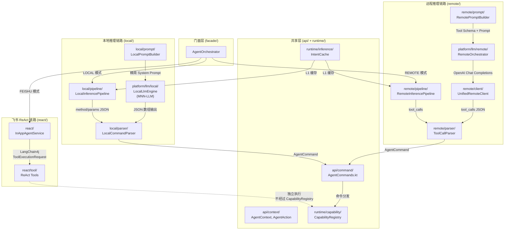

# ADR-006: 本地/远程指令体系包级隔离

**状态**: 已实施 (Implemented)  
**日期**: 2026-06-16  
**更新日期**: 2026-06-18  
**决策**: RD  
**依赖**: ADR-005（本地/远程推理协议分离）

---

## 1. 背景与问题陈述

### 1.1 两套指令体系现状

PicMe 存在两种完全不同的指令体系，分别服务于本地 LLM 和远程 LLM：

| 维度 | 自定义指令体系（本地） | OpenAI tool_calls 体系（远程） |
|------|----------------------|-------------------------------|
| **协议格式** | `[{"method":"...","params":{...}}]` JSON 数组 | `{"tool_calls":[{"id":"call_x","type":"function","function":{"name":"...","arguments":{...}}}]}` |
| **LLM 型号** | Qwen3.5-2B（端侧 MNN-LLM） | 云端 LLM（OpenAI 兼容 API） |
| **约束方式** | JSON 数组 Prompt 约束 + 精简 System Prompt | OpenAI 原生协议约束 |
| **核心解析器** | `AgentCommandParser`（method/params → AgentCommand） | `ToolCallingOutputParser`（tool_calls → ToolExecutionRequest） |
| **Prompt 构造** | `PromptBuilder.buildSystemPrompt/buildL2SystemPrompt` | `PromptBuilder.buildBatchPrompt` + `ToolPromptBuilder` |

### 1.2 混用问题（ADR-005 已解决）

> **2026-06 更新**：下述混用问题已在 ADR-005 Phase 1 中全部解决。`InferenceRouter`、`ToolCallingOutputParser`、`ToolCallingChatLanguageModel`、`ToolPromptBuilder`、`ToolOrchestrator`、`ToolCallingConfig`、`ToolCallingMode` 均已删除。

尽管 ADR-005 已从推理链路层面分离了本地/远程，但**指令体系层面曾存在严重混用**：

```
agent-core/.../runtime/
├── parsing/                  ← 混用
│   ├── AgentCommandParser.kt  # method/params 解析（本地专用）
│   └── PromptBuilder.kt       # 混用了本地 Prompt 和远程 Prompt（~570行）
├── tool/                     ← 混用
│   ├── ToolCallingOutputParser.kt  # 主要解析 tool_calls，但兜底解析 method/params
│   ├── ToolCallingChatLanguageModel.kt  # 远程包装层（含 Prompt 注入）
│   ├── ToolPromptBuilder.kt   # Tool Schema → Prompt 字符串
│   ├── ToolCallingConfig.kt   # 配置类
│   ├── ToolCallingMode.kt     # OPENAI_TOOLS / REACT 枚举
│   └── ToolOrchestrator.kt    # 工具调用编排
├── inference/                ← 汇聚耦合点
│   └── InferenceRouter.kt     # 同时桥接本地/远程两套指令体系
```

**具体问题**：

1. **`PromptBuilder.kt` 单体膨胀**：同一文件包含面向本地小模型的 `buildSystemPrompt`/`buildL2SystemPrompt`（method/params 格式）和面向远程模型的 `buildBatchPrompt`（tool_calls 格式），双方 Prompt 互相干扰。

2. **`ToolCallingOutputParser.kt` 跨格式兜底**：`parseFallbackToolCalls()` 中第 337-350 行显式解析 method/params JSON 数组作为 tool_calls 的兜底方案，这是本不该存在的跨体系耦合。

3. **`RemoteOrchestrator.kt` 双向污染**：远程编排器内含 `parseFallbackToolCalls()` 方法，既解析 tool_calls（核心职责），又兜底解析 method/params（兼容旧格式），增加了维护成本和认知负担。

4. **`InferenceRouter.kt` 桥接逻辑**：第 83-91 行的 `processInputWithTools()` 方法需同时在本地和远程引擎间切换，且需将 tool_calls 请求通过 `toolRequestToAgentCommand()` 转译为内部 method/params 格式（第 274-290 行），增加了不必要的适配层。

5. **无包名/文件名隔离**：两套体系的文件混在 `runtime/parsing/`、`runtime/tool/`、`runtime/inference/` 等包中，无法通过文件系统路径直观判断归属哪个指令体系。

### 1.3 混用风险

| 风险 | 场景 | 可能性 | 影响 |
|------|------|--------|------|
| 本地 Prompt 误改影响远程 | `PromptBuilder.kt` 中本地和远程 Prompt 共处一文件 | 中 | 远程推理异常 |
| 回退解析掩盖远程 Bug | `ToolCallingOutputParser` 兜底解析 method/params 成功，但 tool_calls 实际已失效 | 高 | Bug 延迟发现 |
| 新人混淆开发 | 新开发者不清楚哪个解析器服务于哪个链路 | 高 | 错误修改 |
| 测试覆盖遗漏 | 本地/远程使用同一测试数据格式，无法独立验证 | 中 | 回归风险 |

---

## 2. 决策

### 决策 1: 包级隔离 — 两条指令体系分配独立包路径

#### 目标包结构

```
agent-core/src/main/java/com/mamba/picme/agent/core/
├── api/                              # 共享 API 层（不变）
│   └── command/
│       └── AgentCommands.kt          # AgentCommand 模型（两体系共享）
│
├── local/                            ★ 新增：本地指令体系
│   ├── model/
│   │   └── LocalCommand.kt           # 本地 method/params 协议模型
│   ├── prompt/
│   │   └── LocalPromptBuilder.kt     # 本地 Prompt 构造（从 PromptBuilder 拆分）
│   ├── parser/
│   │   └── LocalCommandParser.kt     # 本地 method/params → AgentCommand 解析
│   └── pipeline/
│       └── LocalInferencePipeline.kt # 本地推理链路（替代 InferenceRouter 中部分逻辑）
│
├── remote/                           ★ 新增：远程指令体系
│   ├── model/
│   │   ├── OpenAiToolCall.kt         # tool_calls 协议模型
│   │   └── ToolSpec.kt               # ToolSpecification 相关模型
│   ├── prompt/
│   │   └── RemotePromptBuilder.kt    # 远程 Prompt 构造（从 PromptBuilder 拆分）
│   ├── parser/
│   │   └── ToolCallParser.kt         # 纯 tool_calls 解析（不含 method/params 兜底）
│   ├── client/
│   │   ├── UnifiedRemoteClient.kt    # OpenAI 协议客户端（从 LangChain4jOpenAiClient 迁移）
│   │   └── OpenAiProtocol.kt         # OpenAI 协议常量与工具函数
│   └── pipeline/
│       └── RemoteInferencePipeline.kt# 远程推理链路
│
├── runtime/                          ★ 清理后保留逻辑
│   ├── capability/                   # Capability 注册、分发（不变）
│   ├── execution/                    # ExecutionPlan、PlanStep（不变）
│   ├── policy/                       # PrivacyGuard（不变）
│   └── state/                        # SceneManager（不变）
│
├── platform/llm/                     ★ 保留 LLM 引擎实现
│   ├── local/
│   │   └── LocalLlmEngine.kt        # 本地 LLM 引擎（不变）
│   └── remote/
│       └── RemoteOrchestrator.kt     # 远程编排器（简化，移除 method/params 兜底）
│
└── facade/
    └── AgentOrchestrator.kt          # 顶层编排（简化路由）
```

#### 包名策略

| 体系 | 包路径范式 | 示例 |
|------|-----------|------|
| **本地指令体系** | `*.agent.core.local.*` | `com.mamba.picme.agent.core.local.parser.LocalCommandParser` |
| **远程指令体系** | `*.agent.core.remote.*` | `com.mamba.picme.agent.core.remote.parser.ToolCallParser` |
| **LLM 引擎** | `*.agent.core.platform.llm.*` | 保持原包路径不变 |
| **共享模型** | `*.agent.core.api.*` | 保持原包路径不变 |

#### 文件名命名规范

| 体系 | 前缀/后缀规则 | 示例 |
|------|-------------|------|
| **本地指令体系** | 类名以 `Local` 开头 | `LocalPromptBuilder`, `LocalCommandParser` |
| **远程指令体系** | 类名以 `ToolCall`/`Remote`/`OpenAi` 开头 | `ToolCallParser`, `RemotePromptBuilder` |
| **协议模型** | 反映协议名称 | `LocalCommand`(method/params), `OpenAiToolCall`(tool_calls) |

---

### 决策 2: 文件级拆分 — 拆分混杂文件

#### 2.1 `PromptBuilder.kt` → 拆分为两个

| 原文件 | 本地体系归属 | 远程体系归属 |
|--------|-------------|-------------|
| `PromptBuilder.kt`（570 行，本地+远程混用） | `local/prompt/LocalPromptBuilder.kt` | `remote/prompt/RemotePromptBuilder.kt` |

**`LocalPromptBuilder.kt` 职责**：
- `buildSystemPrompt()` — 面向本地小模型的完整 System Prompt（method/params 格式）
- `buildL2SystemPrompt()` — 面向本地小模型的精简 System Prompt
- 输出约束：JSON 数组 `[{"method":"...","params":{...}}]`
- 适用场景：`LocalInferencePipeline` 调用

**`RemotePromptBuilder.kt` 职责**：
- `buildSystemPrompt()` — 面向远程模型的完整 System Prompt（tool_calls 格式）
- `buildBatchPrompt()` — L2 批量命令 Prompt（含 Tool Schema 说明）
- `buildPlanPrompt()` — L3 计划 Prompt
- `buildChatPrompt()` — L4 聊天 Prompt
- 输出约束：通过 `ToolSpecification` 定义 tools，模型以 `tool_calls` 返回
- 适用场景：`RemoteInferencePipeline` 调用

#### 2.2 `ToolCallingOutputParser.kt` → 拆分出纯 tool_calls 解析器

| 原文件 | 处置 |
|--------|------|
| `ToolCallingOutputParser.kt`（573 行，含 method/params 兜底） | 删除 |

**新文件**：`remote/parser/ToolCallParser.kt`
- 职责：仅解析标准 OpenAI `tool_calls` 格式 → `ToolExecutionRequest`
- 移除：`SimpleToolCall` 解析（method/params 格式）
- 移除：`<tool_call>` 标签解析（旧版兼容）
- 保留：`parseOpenAiTools()` / `parseReAct()` / `parseOpenAiToolsByRegex()` 
- 保留：`repairJson()` / `balanceBraces()`（JSON 修复仍适用于小模型输出 tool_calls 场景）
- 保留：`fuzzyExtractToolCall()`（兜底提取仍需要）

**删除的兜底逻辑**（原文件第 71-77 行）：
```kotlin
// 2. <tool_call>...</tool_call> 标签（兼容旧格式）← 删除：本地指令不再进入此解析器
```

#### 2.3 `ToolCallingChatLanguageModel.kt` → 删除

| 原文件 | 处置 |
|--------|------|
| `ToolCallingChatLanguageModel.kt`（通过 Prompt 注入模拟 tool_calls） | 删除 |

**理由**：ADR-005 已决策删除此包装层。远程链路直接通过 `UnifiedRemoteClient`（LangChain4j SDK）发出标准 OpenAI 请求并接收标准响应，SDK 原生支持 `tool_calls`。

> **实现说明（2026-06-22）**：`UnifiedRemoteClient` 已在后续重构中被移除，当前远程链路通过 `:agent-core` 的 `OpenAiChatModel` 直接调用 OpenAI API。

#### 2.4 `ToolPromptBuilder.kt` → 并入 RemotePromptBuilder

| 原文件 | 处置 |
|--------|------|
| `ToolPromptBuilder.kt`（将 ToolSpecification 转为 Prompt 字符串） | 删除，功能并入 `RemotePromptBuilder` |

**理由**：远程模型应通过标准 `tool_calls` 协议传递工具 Schema，而非通过字符串注入到 Prompt 中。`RemotePromptBuilder` 只需构建基础的 System Prompt 文本，Tool Schema 通过 ChatRequest 的 `toolSpecifications` 参数传递。

#### 2.5 `InferenceRouter.kt` → 拆分为两条 Pipeline

| 原文件 | 本地体系归属 | 远程体系归属 |
|--------|-------------|-------------|
| `InferenceRouter.kt`（595 行，双向路由） | `local/pipeline/LocalInferencePipeline.kt` | `remote/pipeline/RemoteInferencePipeline.kt` |

**`LocalInferencePipeline.kt` 职责**：
- L1 Cache 命令
- L1.5 Template 匹配
- L2 Batch（本地快速推理）
- 所有本地推理逻辑集中管理

**`RemoteInferencePipeline.kt` 职责**：
- L2 Batch（远程 tool_calls）
- L3 Plan（远程计划执行）
- L4 ReAct Chat（远程对话）
- 所有远程推理逻辑集中管理

**顶层路由**移至 `AgentOrchestrator`：
```kotlin
class AgentOrchestrator(
    private val localPipeline: LocalInferencePipeline,
    private val remotePipeline: RemoteInferencePipeline
) {
    fun dispatch(input: String, context: AgentContext): InferenceResult {
        return when (agentMode) {
            AiAgentMode.LOCAL -> localPipeline.process(input, context)
            AiAgentMode.REMOTE -> remotePipeline.process(input, context)
        }
    }
}
```

#### 2.6 `RemoteOrchestrator.kt` → 移除 method/params 兜底

| 当前行为 | 变更 |
|---------|------|
| `parseFallbackToolCalls()` 方法第 337-350 行解析 method/params JSON 数组 | **删除**：远程链路不再兜底解析本地协议格式 |

**理由**：ADR-005 已完成协议分离，远程链路应仅处理标准 OpenAI 协议。如果远程 API 未返回 `tool_calls`、也未返回 `content`，应直接报错返回，而非尝试解析 method/params。

---

### 决策 3: 测试模型隔离

#### 3.1 `DataDrivenTestModels.kt` 中的 `ActionJson`

| 当前 | 变更 |
|------|------|
| `ActionJson(method, params)` 作为通用测试模型 | **标记为本地测试专用**：仅由 `LocalTestEngine` 使用 |

```kotlin
// 新增：远程测试协议模型（独立文件）
@JsonClass(generateAdapter = true)
data class RemoteActionJson(
    @Json(name = "tool_calls")
    val toolCalls: List<RemoteToolCall>
)

@JsonClass(generateAdapter = true)
data class RemoteToolCall(
    val id: String,
    val type: String = "function",
    val function: RemoteFunction
)

@JsonClass(generateAdapter = true)
data class RemoteFunction(
    val name: String,
    val arguments: String   // JSON string
)
```

#### 3.2 测试文件分离

| 当前 | 变更 |
|------|------|
| `agent/test/` 测试混用本地/远程 | 按包拆分为 `local/` 和 `remote/` |
| `app/src/test/.../AgentTestEngine.kt` 使用 method 映射 | 按包拆分为 `LocalTestEngine` 和 `RemoteTestEngine` |

---

## 3. 技术实现

### 3.1 包迁移映射表

以下列出所有受影响文件的迁移路径：

| 原文件 | 新位置 | 变更类型 |
|--------|--------|---------|
| `runtime/parsing/PromptBuilder.kt` | → `local/prompt/LocalPromptBuilder.kt` | 拆分 |
| （新文件） | → `remote/prompt/RemotePromptBuilder.kt` | 新增 |
| `runtime/parsing/AgentCommandParser.kt` | → `local/parser/LocalCommandParser.kt` | 重命名+迁移 |
| `runtime/tool/ToolCallingOutputParser.kt` | → `remote/parser/ToolCallParser.kt` | 重命名+简化（移除 method/params 分支） |
| `runtime/tool/ToolCallingChatLanguageModel.kt` | 删除 | 删除 |
| `runtime/tool/ToolPromptBuilder.kt` | 删除，功能并入 `RemotePromptBuilder` | 删除 |
| `runtime/tool/ToolCallingConfig.kt` | 删除（远程配置通过 `RemoteLlmConfig` 管理） | 删除 |
| `runtime/tool/ToolCallingMode.kt` | 删除 | 删除 |
| `runtime/tool/ToolOrchestrator.kt` | → `remote/pipeline/ToolOrchestrator.kt` | 迁移 |
| `runtime/inference/InferenceRouter.kt` | 拆分 → `local/pipeline/LocalInferencePipeline.kt` + `remote/pipeline/RemoteInferencePipeline.kt` | 拆分 |
| `runtime/inference/AdaptiveStrategySelector.kt` | 删除（策略逻辑分散到两条 Pipeline） | 删除 |
| `platform/llm/remote/RemoteOrchestrator.kt` | 保留（移除 method/params 兜底） | 简化 |
| `facade/AgentConfigurator.kt` | 保留（更新注入逻辑） | 修改 |
| `runtime/parsing/AgentCommandParser.kt` 中的 `parseCommandByMethod` | 移至 `api/command/` 下作为共享工具 | 迁移 |

### 3.2 删除依赖关系图

```diff
- runtime/tool/ToolCallingChatLanguageModel.kt
    - 被 inference/InferenceRouter.kt 引用 → 改为直接调用 Platform.chat()
- runtime/tool/ToolPromptBuilder.kt
    - 被 ToolCallingChatLanguageModel.kt 引用 → 自然删除
- runtime/tool/ToolCallingConfig.kt
    - 被 ToolCallingChatLanguageModel.kt + InferenceRouter.kt 引用 → 移除
- runtime/tool/ToolCallingMode.kt
    - 被 ToolCallingConfig.kt 引用 → 自然删除
```

### 3.3 保留的组件

| 组件 | 理由 |
|------|------|
| `api/command/AgentCommands.kt` | 共享领域模型，两套体系都使用 |
| `api/command/AgentCommand.kt` | 共享领域模型 |
| `api/context/AgentContext.kt` | 共享上下文 |
| `api/ToolSpecification.kt` | 远程体系使用（OpenAI tool schema 定义） |
| `api/ToolExecutionRequest.kt` | 远程体系使用（OpenAI tool_calls 产物） |
| `api/ToolProvider.kt` | 远程体系使用（工具提供者接口） |
| `api/ChatLanguageModel.kt` | 两套体系共享的 LLM 调用接口 |
| `platform/llm/local/LocalLlmEngine.kt` | 本地引擎实现（不变） |
| `platform/llm/remote/RemoteOrchestrator.kt` | 远程编排器（简化后保留） |
| `platform/llm/remote/LangChain4jOpenAiClient.kt` | `RemoteOrchestrator` 内部依赖 |

### 3.4 移除的相互引用

**`ToolCallingOutputParser` 中需要删除的 method/params 兜底代码**：

原始文件 `ToolCallingOutputParser.kt` 第 71-77 行：
```kotlin
// 2. <tool_call>...</tool_call> 标签（兼容旧格式）← 删除
val tagRegex = Regex("<tool_call>(.*?)</tool_call>", RegexOption.DOT_MATCHES_ALL)
val tagRequests = tagRegex.findAll(text).mapNotNull { match ->
    parseSimple(match.groupValues[1].trim())
}.toList()
if (tagRequests.isNotEmpty()) return tagRequests
```

**`RemoteOrchestrator.kt` 中需要删除的 method/params 兜底代码**：

原始文件 `RemoteOrchestrator.kt` 第 337-350 行：
```kotlin
// 尝试 2: 解析为 method/params JSON 数组（兼容旧格式）← 删除
try {
    val jsonArray = JSONArray(cleaned)
    if (jsonArray.length() > 0) {
        val commands = mutableListOf<AgentCommand>()
        for (i in 0 until jsonArray.length()) {
            try {
                val item = jsonArray.getJSONObject(i)
                commands.add(parseAgentCommand(item, context))
            } catch (e: Exception) {
                Logger.e(tag, "[Fallback] Failed to parse array item #$i", e)
            }
        }
        if (commands.isNotEmpty()) {
            ...
```

---

## 4. 包视图总览

### 4.1 变更前

```
agent.core
├── api/command/       AgentCommands.kt
├── runtime/parsing/   PromptBuilder.kt      ← 混用本地/远程
│                      AgentCommandParser.kt ← 本地 method/params
├── runtime/tool/      ToolCallingOutputParser.kt  ← 含 method/params 兜底
│                      ToolCallingChatLanguageModel.kt
│                      ToolPromptBuilder.kt
│                      ToolCallingConfig.kt
│                      ToolCallingMode.kt
│                      ToolOrchestrator.kt
├── runtime/inference/ InferenceRouter.kt    ← 双向桥接
│                      AdaptiveStrategySelector.kt
├── platform/llm/      local/LocalLlmEngine.kt
│                      remote/RemoteOrchestrator.kt
│                      remote/LangChain4jOpenAiClient.kt
```

### 4.2 变更后（已实施）

```
agent.core
├── api/                    ★ 共享 API 层
│   ├── command/            AgentCommands.kt（PicMe 业务命令）
│   ├── context/            AgentContext, AgentAction, AgentScene
│   ├── android/            RemoteModelConfig
│   └── policy/             AiAgentMode, AiAgentPrivacyLevel
├── local/                  ★ 本地推理链路（MNN-LLM + 自定义 JSON 协议）
│   ├── prompt/             LocalPromptBuilder.kt
│   ├── parser/             LocalCommandParser.kt（method/params → AgentCommand）
│   └── pipeline/           LocalInferencePipeline.kt
├── remote/                 ★ 远程推理链路（OpenAI API + tool_calls）
│   ├── prompt/             RemotePromptBuilder.kt
│   ├── parser/             ToolCallParser.kt（tool_calls → AgentCommand）
│   ├── client/             UnifiedRemoteClient.kt
│   └── pipeline/           RemoteInferencePipeline.kt
├── react/                  ★ 飞书 ReAct 循环（独立指令体系）
│   ├── InAppAgentService.kt
│   └── tool/               ReAct 专用 Tool（apkclaw 风格）
├── runtime/                ★ 运行时基础设施
│   ├── capability/         CapabilityRegistry, CapabilityHost
│   ├── execution/          InferenceResult, ExecutionPlan
│   ├── inference/          IntentCache（L1 缓存，本地/远程共用）
│   ├── policy/             PrivacyGuard
│   └── state/            SceneManager
├── platform/llm/
│   ├── local/              LocalLlmEngine.kt（MNN-LLM 引擎）
│   └── remote/             RemoteOrchestrator.kt（精简版）
│                            LangChain4jOpenAiClient.kt
└── facade/                 AgentOrchestrator.kt（顶层路由）
```

### 4.3 物理隔离架构图



---

## 5. 迁移计划

### Phase 1: 包结构重组（1-2 天）

| 任务 | 说明 | 验收标准 |
|------|------|---------|
| 创建 `local/` 和 `remote/` 包 | 建立新包目录 | 路径存在 |
| `PromptBuilder.kt` 拆分 | 本地 Prompt → `local/prompt/LocalPromptBuilder.kt`，远程 Prompt → `remote/prompt/RemotePromptBuilder.kt` | 编译通过 |
| `AgentCommandParser.kt` 迁移 | 重命名为 `LocalCommandParser.kt`，迁至 `local/parser/` | 编译通过 |
| `ToolCallingOutputParser.kt` 迁移+简化 | 重命名为 `ToolCallParser.kt`，迁至 `remote/parser/`，移除 method/params 兜底 | 编译通过 |

### Phase 2: 冗余删除（1 天）

| 任务 | 说明 | 验收标准 |
|------|------|---------|
| 删除 `ToolCallingChatLanguageModel.kt` | 远程链路直接使用 SDK 原生工具调用 | 编译通过 |
| 删除 `ToolPromptBuilder.kt` | 功能并入 `RemotePromptBuilder` | 编译通过 |
| 删除 `ToolCallingConfig.kt` | 配置由远程链路独立管理 | 编译通过 |
| 删除 `ToolCallingMode.kt` | 不再需要模式枚举 | 编译通过 |
| `RemoteOrchestrator.kt` 简化 | 移除 `parseFallbackToolCalls()` 中的 method/params 分支 | 编译通过 + 远程链路测试通过 |

### Phase 3: Pipeline 重构（2 天）

| 任务 | 说明 | 验收标准 |
|------|------|---------|
| 拆分 `InferenceRouter.kt` | 本地逻辑 → `LocalInferencePipeline.kt`，远程逻辑 → `RemoteInferencePipeline.kt` | 编译通过 |
| 更新 `AgentOrchestrator.kt` | 直接调度两条 Pipeline | 本地/远程入口均正常工作 |
| 删除 `AdaptiveStrategySelector.kt` | 策略逻辑分散到两条 Pipeline | 编译通过 |

---

## 6. 后果分析

### 正面影响

- ✅ **直观分隔**：通过 `local/` ↔ `remote/` 包名即刻区分指令体系，无需深入阅读代码
- ✅ **文件名自我描述**：`LocalCommandParser` 处理 method/params，`ToolCallParser` 处理 tool_calls，语义清晰
- ✅ **跨体系污染消除**：远程链路不再兜底解析 method/params，本地链路不包含 tool_calls 逻辑
- ✅ **新人上手成本降低**：包路径即文档，直观理解代码归属
- ✅ **修改安全**：修改本地解析逻辑不用担心影响远程，反之亦然
- ✅ **测试独立**：本地测试和远程测试使用各自协议模型，互不干扰
- ✅ **与 ADR-005 一脉相承**：协议分离 → 代码分离，逻辑一致

### 负面影响

- ⚠️ **短期改动量较大**：多个文件和引用的导入路径需同步更新，约 15-20 个文件受影响
- ⚠️ **git blame 信息丢失**：重命名和迁移后，git 历史追溯需使用 `--follow` 参数
- ⚠️ **第三方代码集成需适配**：如 `LangChain4j` 集成代码的导入路径可能需要调整

### 风险评估

| 风险 | 概率 | 影响 | 缓解措施 |
|------|------|------|---------|
| 导入路径遗漏导致编译失败 | 高 | 高 | 逐一文件验证，编译检查 |
| `RemoteOrchestrator` method/params 兜底删除后远程出现兼容性问题 | 中 | 高 | 确保远程 API 正确返回 tool_calls，CF/SFC 网关配置检查 |
| `InferenceRouter` 拆分遗漏逻辑分支 | 中 | 中 | 逐行比对拆分前后的条件分支 |

---

## 7. 状态

| 阶段 | 状态 | 日期 |
|------|------|------|
| 提议 | ✅ 已实施 | 2026-06-18 |
| Phase 1: 包结构重组 | ✅ 已完成 | 2026-06-18 |
| Phase 2: 冗余删除 | ✅ 已完成 | 2026-06-18 |
| Phase 3: Pipeline 重构 | ✅ 已完成 | 2026-06-18 |

> **实现差异说明（2026-06-22）**：本 ADR 的核心原则（本地/远程包物理隔离）已完全落实，但实际实现与提议的目标包结构存在以下差异：
> - **包路径**：实际使用 `inference/local/` 和 `inference/remote/` 而非提议的 `local/` 和 `remote/` 直铺（保留 `inference/` 父级以便代码导航）
> - **文件名**：`ToolCallParser.kt` → 实际为 `ToolCallCommandParser.kt`
> - **已移除的类**：本 ADR 中引用的 `UnifiedRemoteClient`、`LangChain4jOpenAiClient` 已不存在。当前远程推理架构为：`:agent-core`（Java 库）提供 `OpenAiChatModel`/`OpenAiStreamingChatModel`，`:app` 模块的 `RemoteOrchestrator` 直接使用 `:agent-core` API 编排，无独立的客户端包装层
> - **react 包**：位于 `inference/remote/react/` 而非提议的 `react/` 顶层包
> - **GBNF Grammar**：提议中列为本地约束方式，实际已尝试后放弃

---

## 8. 相关文档

- `ADR-005` — 本地/远程推理协议分离（本 ADR 的前置决策）
- `agent-core/AGENTS.md` — Agent Core 模块规范（需同步更新）
- `docs/03-TECHNICAL-SPECS/FRAME_SYNC_TECH_SPEC.md` — 帧同步技术规范
- `docs/03-TECHNICAL-SPECS/CAPABILITY_LIFECYCLE_DESIGN.md` — Capability 生命周期
