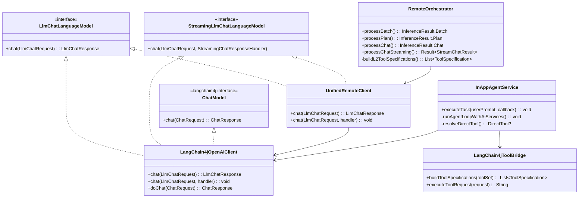

# PicMe 远程推理 ReAct 模式架构审查报告

> 生成时间：2026-06-19
> 审查范围：agent-core 远程推理链路（ReAct / L2-L4 / 飞书远程控制）
> 版本基线：langchain4j 1.13.0+，OpenAI Chat Completions API 协议

---

> **文档状态注记（2026-06-21）**：本审查报告中引用的 `REMOTE_LLM_ORCHESTRATION_DESIGN.md` 已被 ADR-005/006 取代并移除。该文档描述的 `InferenceRouter`、`AdaptiveStrategySelector`、`ToolOrchestrator` 等组件已从代码中完全删除。当前远程推理架构以 `docs/02-ARCHITECTURE/ADR/ADR-005-local-remote-inference-split.md` 和 `docs/02-ARCHITECTURE/ADR/ADR-006-command-system-separation.md` 为准。

## 1. 架构全景图

```mermaid
graph TB
    subgraph "应用层 (app/)"
        AUC[AiAgentUseCase<br/>Facade + 模式路由]
    end

    subgraph "编排层 (facade/)"
        AO[AgentOrchestrator<br/>统一入口 + 模式分发]
    end

    subgraph "远程推理层 (remote/ + react/)"
        RIP[RemoteInferencePipeline<br/>L1缓存/隐私检查/L2入口]
        RO[RemoteOrchestrator<br/>L2 Batch / L3 Plan / L4 Chat]
        RP[RemotePromptBuilder<br/>Batch/Plan/Chat Prompt]
        TCP[ToolCallCommandParser<br/>tool_calls → AgentCommand]
        RCT[RemoteCameraTools<br/>@Tool 注解工具集]

        IAS[InAppAgentService<br/>飞书 ReAct 手动循环]
        IAC[InAppAgentConfig<br/>System Prompt + 配置]
        LTB[LangChain4jToolBridge<br/>ToolSpec 构建 + 执行]
        ITS[InAppToolSet<br/>UI 自动化 @Tool 工具集]
    end

    subgraph "协议层 (platform/llm/remote/)"
        URC[UnifiedRemoteClient<br/>协议路由: OPENAI/CLAUDE]
        L4C[LangChain4jOpenAiClient<br/>OpenAI 协议实现]
        CAC[ClaudeCodingApiClient<br/>Retrofit 保留]
    end

    subgraph "本地推理层 (local/ + platform/llm/local/)"
        LLE[LocalLlmEngine<br/>MNN-LLM 本地推理]
        LCP[LocalCommandParser<br/>method/params 解析]
    end

    subgraph "能力层 (runtime/)"
        CR[CapabilityRegistry<br/>命令分发]
        SM[SceneManager<br/>场景状态]
        IC[IntentCache<br/>L1 缓存]
        PG[PrivacyGuard<br/>隐私分级]
        MM[MemoryManager<br/>对话历史]
    end

    AUC --> AO
    AO -->|LOCAL| LLE
    AO -->|REMOTE/FEISHU| RIP
    AO -->|FEISHU ReAct| IAS

    RIP --> RO
    RO --> RP
    RO --> TCP
    RO -->|L2 tool_calls| L4C
    RO -->|L3 Plan JSON| L4C
    RO -->|L4 Chat| L4C

    IAS --> L4C
    IAS --> LTB
    LTB --> ITS
    LTB --> RCT

    URC -->|OPENAI| L4C
    URC -->|CLAUDE| CAC

    RO -->|fallback| LLE
    LLE --> LCP
    TCP -->|解析为| CR
    LCP -->|解析为| CR
```

---

## 2. 现状总结

### 2.1 已实现能力

| 层级 | 能力 | 状态 | 说明 |
|------|------|------|------|
| **L2 Batch** | 批量 Function Calling | 稳定 | `RemoteOrchestrator.processBatch`，通过 `toolSpecifications` 强制模型输出 tool_calls，支持多命令并行 |
| **L3 Plan** | 计划执行 | 可用 | `RemoteOrchestrator.processPlan`，输出 ExecutionPlan JSON，steps 内嵌 tool_calls 格式命令 |
| **L4 Chat** | 纯文本对话 | 稳定 | 流式 + 非流式双通道，`processChat` / `processChatStreaming` |
| **飞书 ReAct** | 多轮 Observe→Think→Act | 可用 | `InAppAgentService`，手动实现 ReAct 循环（绕过 AiServices ServiceLoader 阻塞） |
| **协议适配** | OpenAI / Claude / DeepSeek | 稳定 | `UnifiedRemoteClient` 自动路由，`LangChain4jOpenAiClient` 处理 tool_calls、流式、Token 统计 |
| **Fallback** | 远程失败回退本地 | 可用 | `AgentOrchestrator` 中 REMOTE 失败时自动 fallback 到 MNN-LLM |
| **ChatMemory** | 多轮对话历史 | 可用 | `DataStoreChatMemory` 持久化，滑动窗口 10 条消息 |

### 2.2 关键设计决策（已落地）

1. **本地/远程协议彻底分离**（ADR-005）：
   - 本地：自定义 JSON 数组协议（`method + params`）
   - 远程：标准 OpenAI Chat Completions API（`tool_calls`）
   - 两条链路无共享路由逻辑

2. **langchain4j 标准化**：
   - `LangChain4jOpenAiClient` 实现 `ChatModel` 接口，支持 `doChat(ChatRequest)`
   - 强制 `toolChoice = REQUIRED` 确保模型必须调用工具
   - DeepSeek 适配：禁用 thinking、additionalProperties: false

3. **线程隔离**：
   - 网络线程（PicMe-Network-Thread）专用单线程执行 HTTP 调用
   - 与编排线程、DataStore 线程、LLM 推理线程完全隔离

---

## 3. 问题识别

### 3.1 架构层问题

#### P0: 两套并行的 Tool 体系（严重冗余）

| 体系 | 位置 | 用途 | 构建方式 |
|------|------|------|----------|
| **Remote L2 ToolSpecs** | `RemoteOrchestrator.buildL2ToolSpecifications()` | L2 Batch 推理 | 手动 `ToolSpecification.builder()` |
| **ReAct ToolSpecs** | `LangChain4jToolBridge.buildToolSpecifications()` | 飞书 ReAct | 手动 `ToolSpecification.builder()` |
| **RemoteCameraTools** | `RemoteCameraTools` | 远程工具执行 | `@Tool` 注解 |
| **InAppToolSet** | `InAppToolSet` | 飞书 UI 自动化 | `@Tool` 注解 |

**问题**：
- `RemoteOrchestrator` 的 L2 ToolSpecs 与 `LangChain4jToolBridge` 的 ReAct ToolSpecs **内容高度重复**（capture、adjust_beauty、switch_filter 等 15+ 个工具定义重复）
- `RemoteCameraTools` 与 `InAppToolSet` 的相机命令实现 **几乎完全相同**（都委托给 `CameraToolHelper.executeCameraCommand`）
- 维护成本：新增一个相机命令需要修改 4 个地方（L2 specs、ReAct specs、RemoteCameraTools、InAppToolSet）

**建议**：
- 统一 ToolSpecification 来源：从单一注解类自动生成（如 `RemoteCameraTools`），同时供 L2 Batch 和 ReAct 使用
- 或引入 `ToolRegistry` 统一注册，支持 `toLangChain4jSpec()` 和 `toRemoteOrchestratorSpec()` 两种输出格式

#### P1: 两套并行的 ChatMemory 实现

| 实现 | 位置 | 用途 |
|------|------|------|
| `DataStoreChatMemory` | `RemoteOrchestrator.kt` 内联 | RemoteOrchestrator 使用 |
| `DataStoreChatMemory` | `InAppAgentService.kt` 内联 | 飞书 ReAct 使用 |

**问题**：两个完全相同的 `DataStoreChatMemory` 类分别内联在两个文件中，代码重复。

**建议**：提取到 `platform/storage/` 作为公共类。

#### P2: 两套并行的命令解析器

| 解析器 | 协议 | 用途 |
|--------|------|------|
| `ToolCallCommandParser` | tool_calls (OpenAI) | 远程 L2/L3 |
| `LocalCommandParser` | method/params (自定义) | 本地推理 |

**现状合理**（协议分离要求），但 `ToolCallCommandParser` 与 `LocalCommandParser` 的**命令映射逻辑重复**（如 `resolveFilterType`、`resolveStyleFilter` 等辅助方法）。

**建议**：提取公共的 `CommandResolver` 工具类，统一处理 FilterType/StyleFilter/MediaType 等枚举映射。

### 3.2 接口层问题

#### P3: `AiAgentUseCase` 与 `AgentOrchestrator` 职责重叠

- `AiAgentUseCase` 是 Facade，但内部又创建了一个独立的 `RemoteOrchestrator` 实例（`private val remoteOrchestrator`）
- `AgentOrchestrator` 内部也有 `configurator.getRemoteOrchestrator()` / `getRemotePipeline()`
- 结果：`AiAgentUseCase.remoteOrchestrator` 和 `AgentOrchestrator.configurator.remoteOrchestrator` 是**两个独立实例**，各自管理 ChatMemory，导致**对话历史不共享**

**建议**：`AiAgentUseCase` 应完全委托给 `AgentOrchestrator`，不持有独立的 `RemoteOrchestrator` 实例。

#### P4: `AgentOrchestrator` 过于庞大（912 行）

职责混杂：
- 模式路由（LOCAL/REMOTE/OFF/FEISHU）
- 本地模型生命周期管理（load/unload/trim）
- 场景管理（transitionToScene/navigateBack）
- 流式聊天（streamChatLocal/streamChatRemote）
- 飞书 ReAct 入口（processFeishuInput）
- 对话历史保存（saveConversation）
- 结果转换（handleInferenceResult）

**建议**：按职责拆分：
- `AgentRouter`：模式路由
- `LocalInferenceManager`：本地模型生命周期
- `StreamingChatManager`：流式聊天协调
- `FeishuReActCoordinator`：飞书 ReAct 入口

#### P5: `LangChain4jOpenAiClient` 接口膨胀

实现了 3 个接口：
- `LlmChatLanguageModel`（PicMe 自定义）
- `StreamingLlmChatLanguageModel`（PicMe 自定义）
- `ChatModel`（langchain4j 官方）

同时提供 `chat(LlmChatRequest)` 和 `doChat(ChatRequest)` 两套方法，内部互相转换。

**建议**：
- 明确分层：`LangChain4jOpenAiClient` 只实现 `ChatModel`（langchain4j 标准）
- 在 `UnifiedRemoteClient` 或新增 `ChatModelAdapter` 中做 `LlmChatRequest ↔ ChatRequest` 转换
- 或彻底放弃 PicMe 自定义的 `LlmChatLanguageModel` 接口，全面使用 langchain4j 标准接口

### 3.3 代码层问题

#### P6: `RemoteCameraTools` 疑似死代码

`RemoteCameraTools` 使用 `@Tool` 注解，但：
- L2 Batch 使用 `RemoteOrchestrator.buildL2ToolSpecifications()` 手动构建 ToolSpec，不从注解提取
- 飞书 ReAct 使用 `InAppToolSet` 的 `@Tool` 注解，通过 `LangChain4jToolBridge` 反射提取

`RemoteCameraTools` 没有被任何代码实例化或调用，疑似遗留。

**建议**：确认是否被使用；如未使用则删除，或统一为 `InAppToolSet` 的子集。

#### P7: `InAppAgentService` 直接意图映射（resolveDirectTool）与 L2 缓存冲突

`InAppAgentService.resolveDirectTool()` 实现了硬编码的意图映射（如"打开相机"→`navigate_to`），这与 `RemoteInferencePipeline` 的 L1 `IntentCache` 功能重复。

**建议**：
- 飞书 ReAct 也应使用统一的 `IntentCache` 做 L1 快速命中
- 或删除 `resolveDirectTool`，完全依赖 LLM 的 tool calling 能力

#### P8: `RemotePromptBuilder` 的示例格式隐患

`buildBatchPrompt` 中示例使用自然语言描述：
```
用户: 3秒后拍照 -> 调用 delay(delay_ms=3000) + capture()
```

这与已记录的 pitfall（`远程推理 Prompt 示例格式需与 tool_calls 协议一致`）存在矛盾。虽然当前代码注释说明"不在 Prompt 中提供具体 tool_calls JSON 示例"，但自然语言示例仍可能引导模型输出错误格式。

**建议**：移除所有自然语言格式的工具调用示例，或明确标注"此为人类可读说明，非模型输出格式"。

### 3.4 设计层问题

#### P9: ReAct 循环未使用 langchain4j AiServices（技术债注释）

`InAppAgentService` 注释说明：
> 绕过 LangChain4j AiServices.builder() 的 ServiceLoader 阻塞问题

当前手动实现 ReAct 循环，需要自行管理：
- Tool 调用轮次
- ChatMemory 更新
- 死循环检测
- 结果消息回传

**建议**：评估 langchain4j 新版本（1.16.3）是否已修复 ServiceLoader 问题，如已修复应迁移到 `AiServices.builder()` 标准 ReAct 实现，减少维护负担。

#### P10: `RemoteInferencePipeline` 功能单薄

`RemoteInferencePipeline` 仅做 L1 缓存查询 + 隐私检查，然后直接委托给 `RemoteOrchestrator.processBatch`。L3/L4 入口直接暴露 `RemoteOrchestrator` 方法。

**建议**：明确 Pipeline 的职责边界——是仅做轻量路由，还是应承担更多编排逻辑（如 L2→L3→L4 的降级链）。当前设计下，`RemoteInferencePipeline` 的存在价值有限。

---

## 4. 优化建议汇总

### 4.1 高优先级（结构优化）

| 编号 | 优化项 | 影响范围 | 预估工作量 |
|------|--------|----------|----------|
| O1 | **统一 ToolSpecification 来源**：从 `InAppToolSet` 自动生成，供 L2 Batch 和 ReAct 共用 | `RemoteOrchestrator`, `LangChain4jToolBridge`, `RemoteCameraTools` | 2-3 天 |
| O2 | **提取公共 DataStoreChatMemory** 到 `platform/storage/` | `RemoteOrchestrator`, `InAppAgentService` | 0.5 天 |
| O3 | **合并 AiAgentUseCase 的 RemoteOrchestrator 到 AgentOrchestrator** | `AiAgentUseCase`, `AgentOrchestrator`, `AgentConfigurator` | 1-2 天 |
| O4 | **拆分 AgentOrchestrator** 为 Router/LocalManager/StreamingManager/ReActCoordinator | `AgentOrchestrator` 及所有调用方 | 3-5 天 |

### 4.2 中优先级（接口简化）

| 编号 | 优化项 | 影响范围 | 预估工作量 |
|------|--------|----------|----------|
| O5 | **简化 LangChain4jOpenAiClient 接口**：只保留 `ChatModel`，转换逻辑上移 | `LangChain4jOpenAiClient`, `UnifiedRemoteClient` | 1-2 天 |
| O6 | **提取公共 CommandResolver**：统一 FilterType/StyleFilter/MediaType 映射 | `ToolCallCommandParser`, `LocalCommandParser` | 0.5 天 |
| O7 | **清理 RemoteCameraTools**：确认死代码后删除或合并到 InAppToolSet | `RemoteCameraTools` | 0.5 天 |

### 4.3 低优先级（细节打磨）

| 编号 | 优化项 | 影响范围 | 预估工作量 |
|------|--------|----------|----------|
| O8 | **统一飞书 ReAct 的 L1 缓存**：使用 `IntentCache` 替代 `resolveDirectTool` | `InAppAgentService` | 0.5 天 |
| O9 | **修正 Prompt 示例格式**：消除自然语言工具调用示例 | `RemotePromptBuilder` | 0.5 天 |
| O10 | **评估迁移到 AiServices**：测试 langchain4j 1.16.3 ServiceLoader 问题 | `InAppAgentService` | 1-2 天 |

---

## 5. 包结构审查

### 5.1 当前包结构

```
agent-core/src/main/java/com/mamba/picme/agent/core/
├── api/                          # 公共接口（合理）
│   ├── LlmChatRequest.kt         # 自定义请求（建议：迁移到 langchain4j ChatRequest）
│   ├── LlmChatLanguageModel.kt   # 自定义接口（建议：迁移到 langchain4j ChatModel）
│   ├── StreamingLlmChatLanguageModel.kt  # 自定义接口（建议：评估必要性）
│   ├── LlmChatResponse.kt        # 自定义响应（建议：直接使用 langchain4j ChatResponse）
│   └── ...
├── facade/                       # 编排门面
│   └── AgentOrchestrator.kt      # 过于庞大，需拆分
├── local/                        # 本地推理（清晰）
├── remote/                       # 远程推理（清晰）
│   ├── parser/                   # ToolCallCommandParser
│   ├── pipeline/                 # RemoteInferencePipeline（职责可扩展）
│   ├── prompt/                   # RemotePromptBuilder
│   └── tool/                     # RemoteCameraTools（疑似死代码）
├── react/                        # 飞书 ReAct
│   ├── InAppAgentService.kt      # 手动 ReAct 循环
│   ├── InAppAgentConfig.kt       # 配置 + System Prompt
│   ├── llm/
│   │   └── LangChain4jToolBridge.kt  # ToolSpec 构建 + 执行
│   ├── tool/
│   │   └── InAppToolSet.kt       # UI 自动化 @Tool 工具
│   └── perception/               # 屏幕感知
└── platform/llm/remote/          # 协议层
    ├── UnifiedRemoteClient.kt    # 协议路由
    ├── LangChain4jOpenAiClient.kt # OpenAI 实现（接口过多）
    └── claude/                   # Claude 保留实现
```

### 5.2 建议调整

```
agent-core/src/main/java/com/mamba/picme/agent/core/
├── api/                          # 保留：AgentCommand, AgentContext, AgentAction 等核心模型
├── inference/                    # 新增：统一推理抽象
│   ├── local/                    # 本地推理（原 local/）
│   ├── remote/                   # 远程推理（合并 remote/ + react/ + platform/llm/remote/）
│   │   ├── client/               # API 客户端（UnifiedRemoteClient, LangChain4jOpenAiClient, Claude）
│   │   ├── orchestrator/         # 编排器（RemoteOrchestrator）
│   │   ├── pipeline/             # 管道（RemoteInferencePipeline）
│   │   ├── prompt/               # Prompt 构建
│   │   ├── parser/               # 命令解析（ToolCallCommandParser）
│   │   └── react/                # ReAct 模式
│   │       ├── InAppAgentService.kt
│   │       ├── InAppAgentConfig.kt
│   │       └── tool/
│   │           ├── ToolRegistry.kt       # 统一工具注册（替代 LangChain4jToolBridge + RemoteCameraTools）
│   │           ├── InAppToolSet.kt       # UI 自动化工具
│   │           └── CameraToolDelegate.kt # 相机命令委托（统一 executeCameraCommand）
│   └── common/                   # 公共推理组件
│       ├── ChatMemoryStore.kt    # 统一 DataStoreChatMemory
│       └── CommandResolver.kt    # 公共命令映射
├── facade/                       # 门面层（拆分后的轻量入口）
│   ├── AgentRouter.kt            # 模式路由
│   ├── StreamingChatManager.kt # 流式聊天
│   └── FeishuReActCoordinator.kt # 飞书协调
└── platform/                     # 基础设施
    └── storage/                  # DataStoreChatMemory 移到此处
```

---

## 6. 关键接口关系图



---

## 7. 结论

远程推理 ReAct 模式已具备完整的 L2-L4 分层能力和飞书 ReAct 多轮循环能力，协议层通过 langchain4j 实现了标准化，DeepSeek/Kimi/Claude 多供应商适配基本稳定。

**当前最大风险是两套并行 Tool 体系导致的维护成本爆炸**（P0），其次是 `AgentOrchestrator` 和 `AiAgentUseCase` 的实例隔离导致 ChatMemory 不共享（P3）。

建议按 **O1 → O3 → O2 → O4** 的顺序推进重构，先统一工具层，再清理门面层，最后拆分庞大的编排器。
