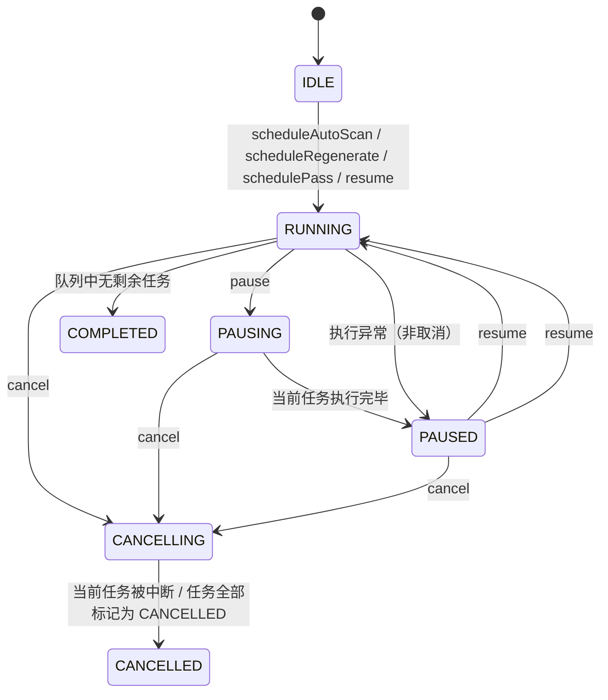

# TAG 扫描状态机

> 文档位置：`docs/03-TECHNICAL-SPECS/TAG_SCAN_STATE_MACHINE.md`
> 关联实现：`app/src/main/java/com/mamba/picme/domain/tag/scan/TagScanOrchestrator.kt`
> 最后更新：2026-06-30

## 1. 设计目标

`TagScanOrchestrator` 通过有限状态机管理 5-Pass TAG 扫描会话（人脸检测 / DBSCAN 聚类 / Qwen 标签 / MobileCLIP 重编码 / ML Kit 标签）。状态机需要满足：

- **可观测**：UI 可实时感知当前阶段
- **可中断**：支持暂停、恢复、取消
- **可恢复**：Service 重建或进程被杀后，任务状态持久化在 `tag_scan_tasks` 表
- **终态明确**：取消后进入 `CANCELLED`，不再允许恢复

## 2. 状态定义

```kotlin
enum class ScanSessionState {
    IDLE,        // 空闲，无活跃会话
    RUNNING,     // 正在执行任务
    PAUSING,     // 已收到暂停指令，等待当前任务结束
    PAUSED,      // 已暂停，可恢复
    CANCELLING,  // 已收到取消指令，正在终止
    CANCELLED,   // 已取消，终态
    COMPLETED    // 全部完成，终态
}
```

## 3. 状态流转图



## 4. 关键行为说明

| 当前状态 | 用户操作 | 实际动作 | 下一状态 |
|---|---|---|---|
| IDLE / PAUSED | 启动扫描 | `createTasks()` + `startSession()` | RUNNING |
| RUNNING | 暂停 | `pauseSession()` 把 PENDING/RUNNING 任务改为 PAUSED | PAUSING |
| PAUSING | — | `pollNextPendingBySession()` 返回 null，当前任务结束后 | PAUSED |
| PAUSED | 恢复 | `resumeSession()` 把 PAUSED 任务改回 PENDING，重新启动协程 | RUNNING |
| RUNNING / PAUSING / PAUSED | 取消 | `cancelSession()` 把任务改 CANCELLED，取消 `currentJob` | CANCELLING |
| CANCELLING | — | `runSession()` 捕获 `CancellationException` 或轮询发现无 PENDING 任务 | CANCELLED |
| RUNNING | — | 所有任务完成 | COMPLETED |
| RUNNING | 执行异常 | `runSession()` catch Exception，状态置为 | PAUSED |

## 5. 防御性规则

- **重复暂停/取消无效**：`pause()` / `cancel()` 内部会检查当前状态，若已处于目标状态或终态则直接返回，避免连续点击产生混乱日志。
- **取消后不可恢复**：`resume()` 检查到 `CANCELLED` / `CANCELLING` 时拒绝恢复。
- **活跃会话唯一**：`startSession()` 通过 `sessionMutex` 保证同一时刻只有一个 `currentJob` 在运行。

## 6. 与数据库任务状态的映射

`tag_scan_tasks.status` 是持久化状态，`ScanSessionState` 是会话级运行时状态。

| 运行时状态 | 对应任务状态 |
|---|---|
| RUNNING | 存在 `RUNNING` 任务 |
| PAUSING / PAUSED | 存在 `PAUSED` 任务，无 `RUNNING/PENDING` |
| CANCELLING / CANCELLED | 存在 `CANCELLED` 任务，无 `RUNNING/PENDING/PAUSED` |
| COMPLETED | 全部任务为 `COMPLETED` |

## 7. UI 反馈

`TagGenerationControlScreen` 根据 `ScanSessionState` 显示：

- `RUNNING`：显示进度条、「暂停」「取消」按钮
- `PAUSING`：显示进度条、禁用态「暂停中...」和可用的「取消」按钮
- `CANCELLING`：显示进度条和「取消中 · 等待当前任务结束」，隐藏所有操作按钮
- `PAUSED`：显示「恢复」「取消」按钮
- `CANCELLED`：显示红色「已取消」卡片，隐藏操作按钮，允许重新开始扫描
- `COMPLETED`：显示完成提示并刷新统计

## 8. 线程模型

```
┌─────────────────────────────────────────────────────────────┐
│  Main Thread（Service / UI）                                 │
│  - onStartCommand 接收 Intent                                 │
│  - serviceScope 分发 pause/resume/cancel 到 control thread    │
└───────────────────────┬─────────────────────────────────────┘
                        │
┌───────────────────────▼─────────────────────────────────────┐
│  tag-control thread（控制线程）                              │
│  - TagScanOrchestrator 状态机                                │
│  - 任务队列 poll / pause / resume / cancel                   │
│  - 进度更新 _progress                                        │
└───────────────────────┬─────────────────────────────────────┘
                        │  dispatch executeTask()
┌───────────────────────▼─────────────────────────────────────┐
│  tag-worker thread（任务线程）                               │
│  - TagGenerationScheduler 原子任务                           │
│  - 人脸检测 / DBSCAN / Qwen JNI 推理                         │
│  可能被 native 推理阻塞，但不影响控制线程                    │
└─────────────────────────────────────────────────────────────┘
```

**关键原则**：

- 控制线程与任务线程必须分离。
- JNI/OpenCL 阻塞只阻塞 `tag-worker`，`tag-control` 仍可立即响应取消、更新 `_progress` 为 `CANCELLED`。
- `cancel()` 会立即把状态置为 `CANCELLED`，任务线程即使仍在运行，其结果也会被 `ensureActive()` 丢弃。
